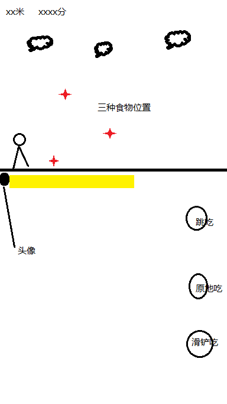

### 系统设计
- 各类manager挂在一个空的node上，用来管理游戏的状态、用户的输入、UI的更新等
- 避免循环引用，保证数据单向流动，实现一个DataCenter来记录所有数据，并保证只能其它实例引用它，它不能引用任何实例
- 注意生命周期，加载场景时实例化的时机是随机的，在start回调中不保证其它实例也已经初始化，可以利用setTimeout延迟执行一些逻辑
### 玩法设计
#### 核心玩法

- 玩家扮演一名小恐龙（或者其它动物，后期可能推出更换皮肤功能），一路向前奔跑，奔跑过程中消耗饥饿条，通过三种不同的按键，接住三个不同方向的食物来增长饥饿条
- 饥饿条设置两个阈值，低于某个值则变瘦，高于某个值则变胖，瘦了跑得快，积分快，但容易饿死，胖了积分慢但不容易饿死
- 吃食物的时机分为普通判定和精准判定，精准判定增长更多饥饿条（或者其它增益BUFF，待定）
- 数值控制：保证食物刷新频率在有失误就会饿死，每次都精准进食就会变胖的程度
#### 待实现模块
##### 角色控制
- 实现一个game manager，管理游戏状态
- 实现一个Input Manager，用来管理用户的输入，player通过Input manager来获取当前输入的指令，需求：**对于不同操作可以映射到同一个指令，如键盘的↑键和UI上的跳按钮都映射到EVENT_KEY_UP**
- 对于player，实现一个简单的状态机，对于不同状态下的逻辑分开处理，并且播放不同的角色动画和音效，角色状态有：IDLE, JUMPING, JUMP_EATING, FALLING, RUNNING, RUN_EATING, SLIDING, SLIDING_EATING等等
- player向Input Manager请求用户输入，根据用户输入和当前的状态，更新状态，根据状态，更新动画和音效等
- 物理效果调整，调整player的重力参数、摩擦参数、加速度参数等来打磨手感
##### 动画逻辑
- 研究cocos creator的animation controller，由于我们没有美术，可以先不实现动画，放一个空的placeholder动画即可，或者使用AI生成
- 为了增加游戏的生动性，场景中的食物、背景等最好也添加一个默认动画，这个优先级比较低
##### 地图卷轴
- 实现2D横向滚动卷轴，使用一张首尾相连的背景图，实现无限滚动
- 后台通过统计跑过的距离，在合适的时间，调整加载的背景图来实现区域切换
- 多层卷轴，不同滚动速度，实现更加立体的效果，如：地面滚动速度大于远景，云朵滚动速度小于远景等
- 令角色不动，地图滚动来模拟角色前进
- 角色在胖瘦不同状态跑动速度不同，所以卷轴滚动速度需要可调节
##### 食物
- 从地图右边随机刷新，实现一个food generator，每一帧进行一次判定，是否生成食物、生成的位置等，频率参数可调
- 实现一个间隔参数，避免一段路上生成过于频繁或者过于空旷
- 每次生成为一个上限可调的队列，保证玩家需要一系列连续操作
- 精准判定和普通判定应该通过动画效果区分
##### 音效
- 低优先级，后面再说
##### UI
- 记分板，分数通过跑动距离、吃食物、精准奖励等多方面因素累积
- 开始按钮
- 三种操作按钮
- 饥饿条
##### 微信接口相关
- 研究如何接入微信小游戏
- 研究微信小游戏的广告API
- 研究腾讯官方云的托管服务，用作网络相关功能，需要实现：获取好友列表、上传成绩
#### 将来可能添加的功能
- 根据跑动距离获取金币，金币可以用来购买商城里的物品
- 商城里出售角色，不同角色功能不同（精准判定帧、饥饿阈值、动作模组等）
- 障碍物